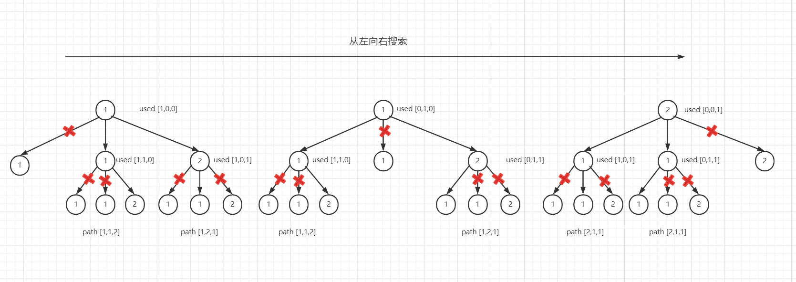
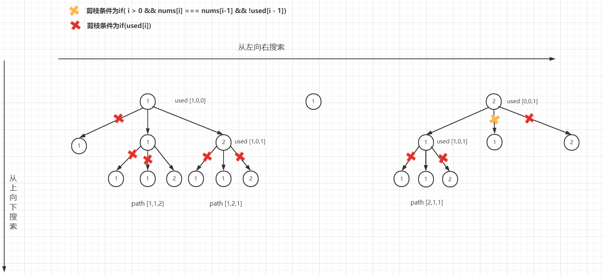
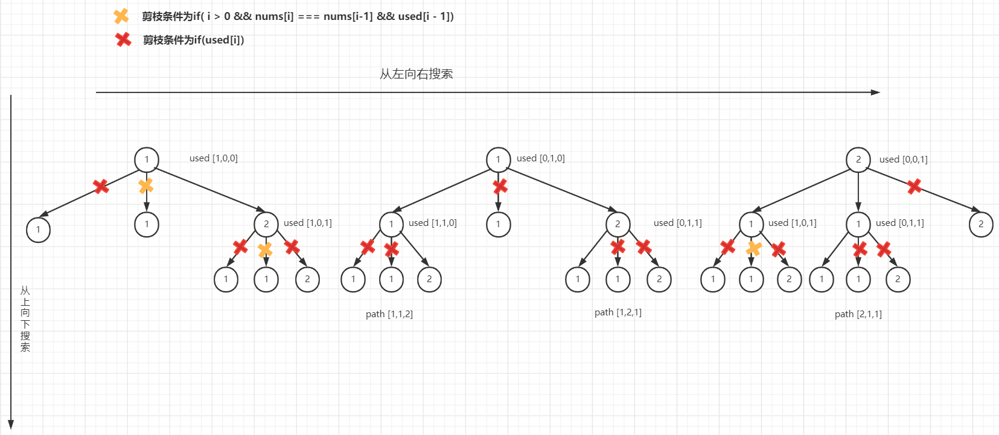

### 全排列II(难度：中等)

#### 题目要求

给定一个可包含重复数字的序列 nums ，按任意顺序 返回所有不重复的全排列。

示例 1：
```
输入：nums = [1,1,2]
输出：
[[1,1,2],
 [1,2,1],
 [2,1,1]]
```

示例 2：
```
输入：nums = [1,2,3]
输出：[[1,2,3],[1,3,2],[2,1,3],[2,3,1],[3,1,2],[3,2,1]]
```

#### 解题思路

这道题是在**第46题：全排列**上进行了修改，将不重复数字的条件修改成了存在重复数字。现在数字存在了重复，所以就会导致答案也会重复，因此需要进行一个去重操作。

先贴上46题的答案
```JavaScript
var permute = function(nums) {
    let res = [];
    let path = [];
    function bakctracking(used){
        if(path.length === nums.length){
            res.push(path.slice(0))
            return
        }
        for(let i = 0; i<nums.length; i++){
        	// 如果为true则表示已经使用过了，直接跳过
            if(used[nums[i]]) continue
            used[nums[i]] = true;
            path.push(nums[i])
            bakctracking(used)
            path.pop()
            used[nums[i]] = false;
        }
    }
    bakctracking([])
    return res
};
```
在46题的答案上，进行了一次剪枝操作，用used数组解决了数字重复选择的问题。但是47题存在重复的数字，所以used数组存储的内容不应该是数组元素，而是它的索引。
```JavaScript
used[i] = true
```
接下来用第47题要再加一个剪枝操作，解决结果重复的问题。

以[1，1，2]为例子，先画出回溯树。



因为重复数据的存在，所以得到的结果也是重复的。
因此当**对第一个1进行查找之后，剩下的1就不应该再接着查找了**，因此可以得到以下剪枝的条件：

```JavaScript
if( i > 0 && nums[i] === nums[i-1] && !used[i - 1]) continue;
```
还是以[1，1，2]为例子，画出回溯树



当对**第二个1**进行查找的时候，**第一个1**肯定已经查找完毕并且回溯到了最初的状态，这也就是**!used[i - 1]**这个条件的由来。

其实 如果把条件**!used[i - 1]**换成**used[i - 1]**，也是一样能返回正确答案的。还是先画出回溯树，看一下为什么：



!used[i - 1]和used[i - 1]这两个条件都能够返回正确的结果，但是从两张图的对比来看，明显!used[i - 1]的效率会比used[i - 1]高很多。因为!used[i - 1]是在树层进行去重，而used[i - 1]是在树枝进行去重。前者的搜索次数明显要比后者少的多。

tips：题目并没有告诉我们数组是有序还是无序的 所以要先对原数组**按照升序进行排列**，让重复的数字挨在一起，方便进行操作。

最后附上源代码:
```javascript
var permuteUnique = function(nums) {
    let res = [];
    let path = [];
    function backtracking(path,used){
        if(path.length === nums.length){
            res.push(path.slice());
            return
        }
        for(let i = 0; i < nums.length; i++){

            if( i > 0 && nums[i] === nums[i-1] && !used[i - 1]) continue;

            if(used[i]) continue;
            
            path.push(nums[i]);
            used[i] = true
            backtracking(path,used)
            path.pop();
            used[i] = false
        }
    }
    nums = nums.sort();
    backtracking(path,[])
    return res
};
```